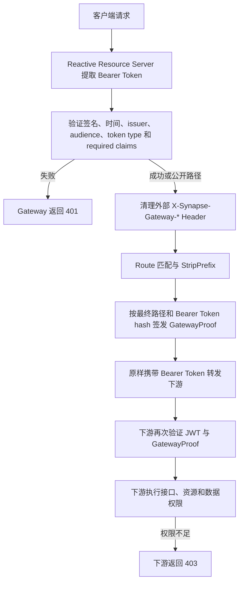

# Synapse Gateway 设计与安全模型

本文描述当前 `synapse-gateway-platform` 已实现的安全、路由和配置事实。部署操作见 [Gateway Docker 部署](../deploy/docker/gateway/README.md)。

## 1. 职责与非职责

Gateway 是平台统一外部入口，负责：

- Spring Cloud Gateway Reactive 路由。
- JWT Access Token 入口认证。
- 明确公开路径白名单，其他路径默认要求认证。
- 清理外部伪造的 `X-Synapse-Gateway-*` Header。
- 为下游请求签发 GatewayProof。
- 原样转发客户端 Bearer Token。

Gateway 不访问数据库，不签发用户 Token，不查询或判断业务权限，不承载 IAM 用户/角色/菜单业务，也不传播可直接信任的身份 Header。接口、资源、组织、租户和数据权限全部由下游服务处理。

## 2. 请求安全链路



JWT 证明调用主体身份，GatewayProof 证明请求经过可信 Gateway。GatewayProof 不能证明用户具备业务权限，两者均不能替代下游授权。

## 3. JWT 验证

Gateway 复用 Framework `synapse-oauth2-resource-server-webflux`，由其完成 Bearer Token 提取、Reactive decoder、签名/时间/issuer/audience/claim 校验、Authentication 建立和统一 401 响应。Gateway 安全链只采用“公开路径 permitAll，其余路径 authenticated”，不配置业务 authority 或 role 判断。

关键配置：

```yaml
synapse.security.resource-server:
  enabled: true
  issuer-uri: ${IAM_ISSUER_URI:http://127.0.0.1:20001}
  jwk-set-uri: ${IAM_JWK_SET_URI:http://127.0.0.1:20001/oauth2/jwks}
  issuer-validation-enabled: true
  audience-validation-enabled: true
  audiences: [${SYNAPSE_GATEWAY_AUDIENCE:synapse-platform}]
  denylist-enabled: false
```

`issuer-uri` 限定 Token 签发方，`jwk-set-uri` 提供验签公钥，`audiences` 防止发给其他服务的 Token 被 Gateway 接受。默认必填 claim 包括 `sub`、`exp`、`iat`、`token_type` 和 `principal_type`。

当前没有真实 `TokenDenylistPort`，因此显式关闭 denylist。当前实现不支持实时撤销已经签发且未过期的 Token，不得将其描述为已具备实时撤销能力。

Token 格式、签名、有效期、`nbf`、issuer、audience、token type 或 required claim 任一不合法时，Gateway 返回 401。合法 Token 即使没有 permissions、roles 或 scope claim，也允许进入转发流程；Gateway 不产生业务权限不足的 403。

### 3.1 公开路径

仅以下路径无需用户 Access Token：

```text
/actuator/health
/actuator/health/**
/actuator/info
/error
/iam/.well-known/**
/iam/oauth2/token
/iam/oauth2/jwks
```

未公开整个 `/iam/**` 或 `/oauth2/**`。白名单匹配 Gateway 对外路径；`StripPrefix=1` 发生在路由转发阶段，不改变安全链看到的外部路径。

当前 IAM Server 尚未实现 OAuth2 Token、JWK 和 discovery 生产端点，上述 IAM 路径是为后续 IAM 能力预留的明确白名单，不代表端点已经可用。当前测试只验证 Gateway 不会错误返回 401；下游不存在时仍可能返回 503。

## 4. GatewayProof 协议

GatewayProof v1 使用 Framework `synapse-security` 的 canonicalization、HMAC-SHA256、token hash、nonce 和 Header 常量，Platform 不自行实现密码算法。

五个 Header：

```text
X-Synapse-Gateway-Proof-Version
X-Synapse-Gateway-Id
X-Synapse-Gateway-Timestamp
X-Synapse-Gateway-Nonce
X-Synapse-Gateway-Signature
```

v1 canonical request 固定为八行：

```text
version
gatewayId
timestamp
nonce
HTTP_METHOD
normalized_path
normalized_query
bearer_token_sha256
```

- 时间戳是 UTC epoch milliseconds。
- nonce 由 Framework 密码学安全随机生成器产生。
- Bearer Token 只以 SHA-256 小写十六进制指纹参与签名；原始 Token 不进入 canonical request。
- query 由 Framework 解析、按 name/value 排序并使用 RFC 3986 UTF-8 percent encoding。
- 不记录 Token、secret、canonical string 或 token 指纹。

### 4.1 Header 清理

任何外部 `X-Synapse-Gateway-*` Header 都不可信。过滤器通过 Framework 的大小写不敏感判断删除全部同前缀 Header，包括未来尚未定义的字段。即使 `GATEWAY_PROOF_ENABLED=false` 也继续清理，防止开发配置让客户端伪造下游信任边界。

### 4.2 最终路径绑定

过滤器顺序位于路由级 `StripPrefix` 和 `RouteToRequestUrlFilter` 之后、Netty 网络转发之前。因此签名绑定最终下游路径，而不是外部路径：

```text
外部请求：GET /iam/test?b=2&a=1
StripPrefix 后：GET /test?b=2&a=1
签名 path：/test
规范化 query：a=1&b=2
```

如果错误地使用 `/iam/test` 验签，Framework verifier 会返回签名无效。顺序由集成测试保护。

### 4.3 环境策略

- `dev` 默认关闭证明，可不提供 secret，但仍清理 Header。
- `beta`、`prd` 默认开启证明。
- 开启时 gateway-id 不能为空，secret 必须至少 32 UTF-8 字节；否则启动失败。
- Gateway 是证明签发方，不启用 `synapse.security.gateway-proof.enabled` 入站验证。

## 5. 静态路由

| 外部前缀 | 下游服务 | 转发处理 |
| --- | --- | --- |
| `/iam/**` | `synapse-iam-server` | `StripPrefix=1` |
| `/resource/**` | `synapse-resource-server` | `StripPrefix=1` |
| `/config/**` | `synapse-config-server` | `StripPrefix=1` |
| `/audit/**` | `synapse-audit-server` | `StripPrefix=1` |
| `/file/**` | `synapse-file-server` | `StripPrefix=1` |
| `/message/**` | `synapse-message-server` | `StripPrefix=1` |
| `/task/**` | `synapse-task-server` | `StripPrefix=1` |
| `/workflow/**` | `synapse-workflow-server` | `StripPrefix=1` |
| `/integration/**` | `synapse-integration-server` | `StripPrefix=1` |
| `/mdm/**` | `synapse-mdm-server` | `StripPrefix=1` |
| `/report/**` | `synapse-report-server` | `StripPrefix=1` |
| `/monitor/**` | `synapse-monitor-server` | `StripPrefix=1` |

服务实例由 Nacos Discovery 和 Spring Cloud LoadBalancer 解析。

## 6. 下游认证与授权

Gateway 保留原始 `Authorization: Bearer ...` Header，不写入或信任 `X-User-Id`、`X-Username`、`X-Roles`、`X-Permissions` 等身份权限 Header。

每个下游服务必须：

1. 独立验证 JWT 签名、时间、issuer、audience 和 claim contract。
2. 验证 GatewayProof，确认请求经过可信 Gateway 且签名材料未被篡改。
3. 在 Controller、方法或业务层执行接口和资源权限。
4. 执行组织、租户、数据范围及资源归属判断。
5. 在业务权限不足时由下游返回 403。

Gateway 已认证不能成为下游跳过 JWT 验证或业务授权的理由。

## 7. 环境变量

| 变量 | 用途 |
| --- | --- |
| `SPRING_PROFILES_ACTIVE` | `dev`、`beta` 或 `prd` |
| `SERVER_PORT` | Gateway 监听端口，默认 `20000` |
| `NACOS_SERVER_ADDR` | Nacos 地址 |
| `NACOS_NAMESPACE` / `NACOS_GROUP` | 环境隔离 |
| `NACOS_USERNAME` / `NACOS_PASSWORD` | Nacos 认证 |
| `IAM_ISSUER_URI` | JWT 预期 issuer |
| `IAM_JWK_SET_URI` | IAM JWK Set 地址 |
| `SYNAPSE_GATEWAY_AUDIENCE` | Gateway 接受的 audience |
| `GATEWAY_PROOF_ENABLED` | 是否签发出站证明 |
| `GATEWAY_ID` | Gateway 标识 |
| `GATEWAY_PROOF_SECRET` | HMAC secret，开启证明时必填 |

## 8. 本地构建与验证

先安装当前 Framework：

```bash
cd ../synapse-framework
mvn clean install
cd ../synapse-platform
```

当前其他 Platform 模块仍有已删除 Framework artifact 的历史依赖，因此 Gateway 定向构建使用子 POM：

```bash
mvn -f synapse-gateway-platform/pom.xml clean test
mvn -f synapse-gateway-platform/pom.xml dependency:tree
```

开发启动需要可访问 IAM JWK；如果只运行自动化测试，不访问真实 IAM/Nacos。

```bash
SPRING_PROFILES_ACTIVE=dev \
IAM_ISSUER_URI=http://127.0.0.1:20001 \
IAM_JWK_SET_URI=http://127.0.0.1:20001/oauth2/jwks \
mvn -f synapse-gateway-platform/pom.xml spring-boot:run
```

## 9. curl 示例

```bash
curl -i http://127.0.0.1:20000/actuator/health/readiness
curl -i http://127.0.0.1:20000/resource/example
curl -i -H 'Authorization: Bearer <access-token>' \
  http://127.0.0.1:20000/resource/example
```

第二个请求应返回 401。第三个请求只有在 Token、IAM JWK、Nacos 和下游服务均有效时才能成功转发。不要把真实 Token 写入脚本或提交到仓库。

## 10. 常见故障

- 启动提示 issuer/audience 配置非法：检查 `IAM_ISSUER_URI` 和 `SYNAPSE_GATEWAY_AUDIENCE`。
- JWT 始终返回 401：检查 JWK 可达性、Token 签名、issuer、audience、有效期和必填 claim。
- beta/prd 启动失败且提示 GatewayProof 配置非法：提供至少 32 字节 secret，确认 `GATEWAY_ID` 非空。
- 下游 GatewayProof 验签失败：确认两端 secret/gateway-id 一致、服务器时间同步，并确认下游使用 StripPrefix 后路径。
- 路由返回 503：检查 Nacos 注册、namespace/group 和目标服务名。
- macOS 出现 Netty DNS native 警告：公共依赖已移除 Mac 专用 native artifact；警告不应通过污染 Linux 镜像解决。

## 11. Kubernetes 后续边界

当前没有 Kubernetes YAML 或 Helm。Gateway 已保持无状态、环境变量配置、stdout/stderr 日志、readiness/liveness 端点和 SIGTERM 优雅停机，后续可映射 Deployment、Service、ConfigMap、Secret 及 probes。迁移任务应独立设计，不在本任务伪称已实现。
